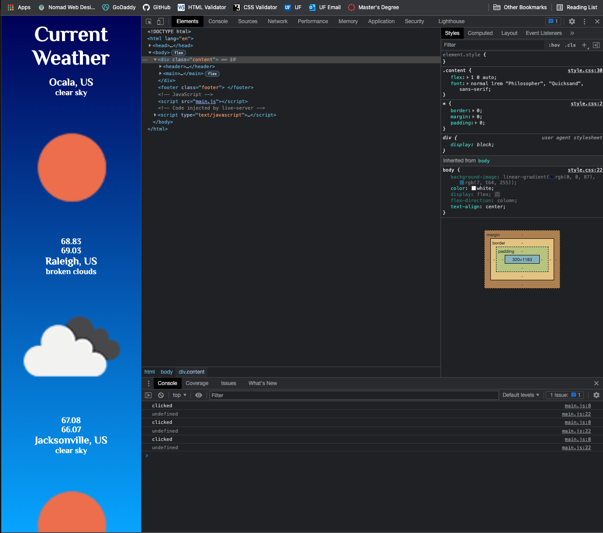

m6-hw9-zehner-jonathan

# Weather Widget Proof of Concept (POC)

This project creates a weather widget that utilizes _Open Weather Map_ for an academic project.

## Coded by: Jonathan A. Zehner

---

### **Outside Resources Credited:**

- Adam Pritchard. (May 29, 2017). _Markdown Cheatsheet_. GitHub. https://github.com/adam-p/markdown-here/wiki/Markdown-Cheatsheet

- Hafsah Emekoma. (August 22, 2020). _Using Fetch API in JavaScript_. Start it up. https://medium.com/swlh/using-fetch-api-in-javascript-62455a998ec2

- George Martsoukos. (April 30, 2021). _Build a simple weather app with vanilla JavaScript_. envatotuts+. https://webdesign.tutsplus.com/tutorials/build-a-simple-weather-app-with-vanilla-javascript--cms-33893

- John Duckett. (2014). _JavaScript & JQuery: interactive front-end web development_. John Wiley & Sons, Inc.

---

---

### **Issues Experienced:**

1. Creating the API call to openweathermap.org. How do you pull the text entered into the search box of the \<form> element into the query portion of the API call in order to return the desired results?

- #### **Resolution:** After extensive research, I pulled ideas from various resources and translated it into working code. Instead of targeting the \<button>, I targeted the \<form> and replaced _onclick_ with _onsubmit_ to encompass other submission methods (pressing enter, rather than clicking the search button).

---

2. Preventing the fetched weather info from stacking instead of replacing. When I perform multiple searches, each returns a result and adds it to the screen creating multiple weather info returns. Instead, I want the new search to replace the old information.

- #### **Resolution:**

---
