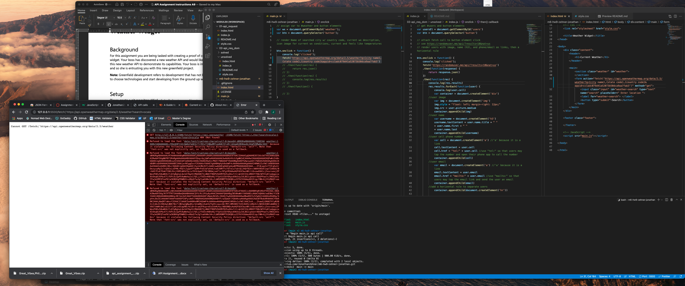

m6-hw9-zehner-jonathan

# Weather Widget Proof of Concept (POC)

This project creates a weather widget that utilizes _Open Weather Map_ for an academic project.

## Coded by: Jonathan A. Zehner

---

### Outside Resources Credited:

- Adam Pritchard. (May 29, 2017). _Markdown Cheatsheet_. GitHub. https://github.com/adam-p/markdown-here/wiki/Markdown-Cheatsheet

- Hafsah Emekoma. (August 22, 2020). _Using Fetch API in JavaScript_. Start it up. https://medium.com/swlh/using-fetch-api-in-javascript-62455a998ec2

---

### Issues Experienced:

1. Creating the API call to openweathermap.org. How do you pull the text entered into the search box of the \<form> element into the query portion of the API call in order to return the desired results?

- #### Resolution:

---
